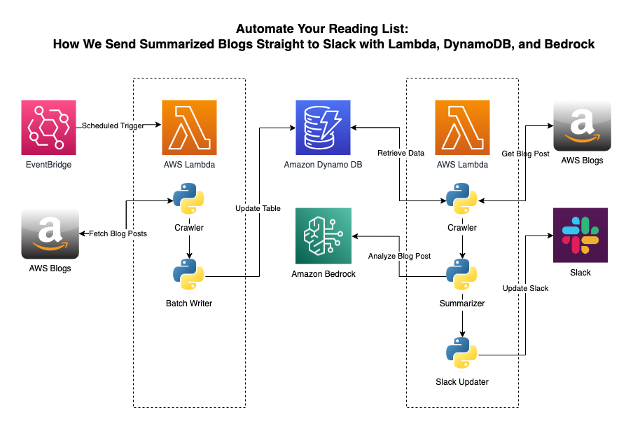

# Project Documentation: AWS Blog Scraper


gathers blogs and info from aws

## Overview

This project provides a set of Python scripts to scrape blog posts from AWS's Networking and Content Delivery blog and store the retrieved information in an Amazon DynamoDB table. The project consists of three main Python files:

1. `blog_worker.py` - Contains functions for scraping data from AWS blog posts.
2. `db_worker.py` - Contains functions for interacting with an Amazon DynamoDB table.
3. `main.py` - Contains the main program logic for scraping and storing data.

## Dependencies

- Python 3.x
- BeautifulSoup4
- boto3
- requests
- logging

To clone this repository, open your terminal and run the following git command:

```bash
git clone https://github.com/labeveryday/getting-started-with-generative-ai.git
```

Navigate to the directory:

```bash
cd getting-started-with-generative-ai
```

## Setting Up a Virtual Environment

It's highly recommended to create a virtual environment to manage dependencies. You can create a virtual environment using venv by running the following command:

```bash
python -m venv myenv
```

Activate the virtual environment:
- On macOS and Linux:
```bash
source myenv/bin/activate
```

- On Windows:
```bash
.\myenv\Scripts\activate
```

## Installing Requirements

Once inside the project directory, install the required Python packages using pip:

```bash
pip install -r requirements.txt
```

>NOTE: Before using the `db_worker.py` you will need to setup [credentials](https://boto3.amazonaws.com/v1/documentation/api/latest/guide/credentials.html) for accessing AWS.

## Files

### blog_worker.py

This file defines the `BlogPost` class that is responsible for scraping the AWS blog pages.

#### Methods

- `get_soup(url: str) -> BeautifulSoup`: 
  - Fetches and returns the BeautifulSoup object for the given URL.
  
- `get_all_url_links_on_page(soup: BeautifulSoup) -> list`: 
  - Retrieves all blog URLs from the AWS Networking and Content Delivery blog.
  
- `check_pagination(soup: BeautifulSoup) -> str`: 
  - Checks for pagination and returns the next URL.
  
- `get_blog_body(soup: BeautifulSoup) -> str`: 
  - Gets the body of the blog post.
  
- `get_blog_dict(soup: BeautifulSoup) -> dict`: 
  - Returns a dictionary containing key information about the blog post.

- `get_tags(blog_title_tags: list) -> list`: 
  - Returns a list of AWS tags associated with the blog post.

### db_worker.py

This file defines the `DynamoDBWorker` class, which encapsulates an Amazon DynamoDB table of blog posts.

#### Methods

- `get_or_create_table() -> Table`: 
  - Gets or creates the DynamoDB table.
  
- `post_item(item: dict) -> None`: 
  - Inserts a new item into the table.
  
- `search_items(attribute: str, value: str, index_name: str=None) -> list`: 
  - Searches for items in the table by attribute.

### main.py

This file contains the main program logic. It utilizes both the `BlogPost` and `DynamoDBWorker` classes to scrape AWS blog posts and store them in a DynamoDB table.

#### Functions

- `main(url: str) -> str`: 
  - Retrieves blog data and returns it as a list of dictionaries.
  
- `sample(url: str, table_name: str, attribute: str, value: str, index_name: str=None) -> list`: 
  - Retrieves specific attributes about blog posts from DynamoDB based on query parameters.

## Usage

Run the `main.py` script to start the scraping process.

```bash
python main.py
```

### Example

```python
from pprint import pprint
url = "https://aws.amazon.com/blogs/networking-and-content-delivery/use-bring-your-own-ip-addresses-byoip-and-rfc-8805-for-localization-of-internet-content/"
table_name = "blog_posts"
data = sample(url, table_name, "date_published", "09-14-2023")
print(data)
```

## Contributing

If you'd like to contribute, please fork the repository and make changes as you'd like. Pull requests are warmly welcomed.

## License

This project is licensed under the BSD 2-Clause License - see the [LICENSE.md](LICENSE.md) file for details.

---

### About me

My passions lie in Network Engineering, Cloud Computing, Automation, and connecting with people. I'm fortunate to weave all these elements together in my role as a Developer Advocate at AWS. On GitHub, I share my ongoing learning journey and the projects I'm building. Don't hesitate to reach out for a friendly hello or to ask any questions!

My hangouts:
- [LinkedIn](https://www.linkedin.com/in/duanlightfoot/)
- [Twitter](https://twitter.com/labeveryday)