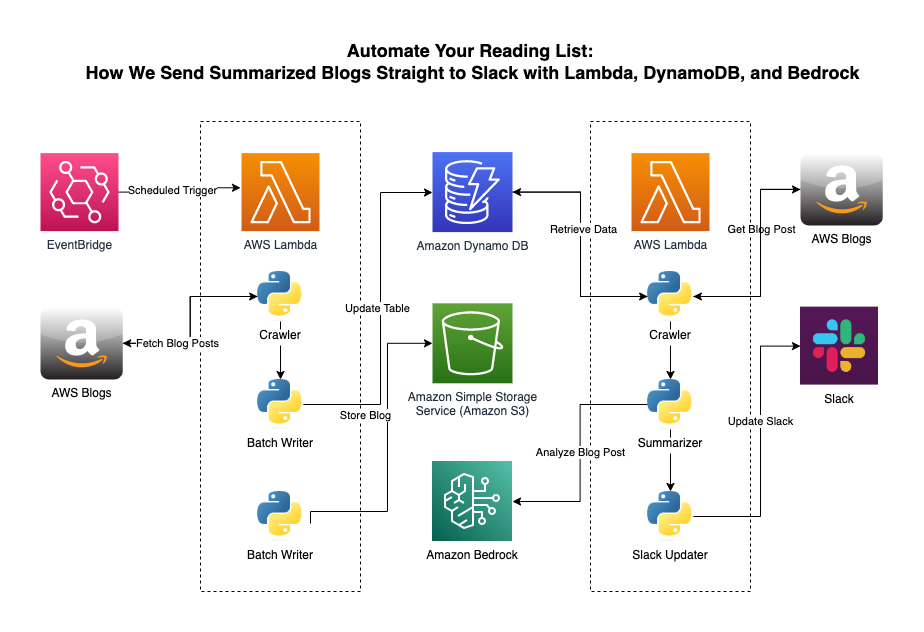

# Project Documentation: AWS Blog to S3

This repo retrieves AWS blog posts from a feed URL and saves them to an Amazon S3 bucket.



This project is for learning purposes and will have multiple phases. 

- **Phase 1**: AWS Blog to S3 <-- Done
- **Phase 2**: Create Amazon Bedrock Knowledge Base based on blog data (In progress)
- **Phase 3**: Schedule blog scraping and automate the syncing of KB
- **Phase 4**: Create an Agent that leverages the KB

## Description

The script takes a URL pointing to a list of AWS blog posts and an S3 bucket name as input. It retrieves each blog post, extracts the metadata and body content, generates a filename, and saves the file directly to the specified S3 bucket.

The main functions are:

- `get_aws_blogs_list` - Retrieves a list of AWS blog post URLs from the feed
- `get_title_string` - Generates a filename string for the S3 object
- `main` - Retrieves the blogs, processes them, and saves to S3

## Usage

From the cli pass in the AWS Blog Home page and the S3 bucket name to save the files to. 

```bash
python main.py --aws_blog_home_url "https://aws.amazon.com/blogs/networking-and-content-delivery/" --bucket_name "my-example-bucket"
```

- `aws_blog_home_url` - The URL of the AWS blog feed (e.g. https://aws.amazon.com/blogs/aws/)
- `bucket_name` - The name of the S3 bucket to save files to

This repo will crawl through each post on the `aws.amazon.com/blogs/example` site list and then store them in S3. Right now the tool will only gather posts back until 2017. If you need older posts feel free to do a PR or to reach out to me. 

Here are some sites you can use:

- https://aws.amazon.com/blogs/security/
- https://aws.amazon.com/blogs/networking-and-content-delivery/
- https://aws.amazon.com/blogs/architecture/
- https://aws.amazon.com/blogs/devops/
- https://aws.amazon.com/blogs/mobile/


## Dependencies

- Python 3.x
- BeautifulSoup4
- boto3
- requests

To clone this repository, open your terminal and run the following git command:

```bash
git clone https://github.com/labeveryday/aws_blog_worker.git
```

Navigate to the directory:

```bash
cd aws_blog_worker
```

## Setup

It is recommended to use a virtual environment:

- On macOS and Linux:
```bash
python3 -m venv venv
source venv/bin/activate
```

- On Windows:
```bash
.\myenv\Scripts\activate
```

Install dependencies:

```bash
pip install -r requirements.txt
```

>NOTE: Before using the `main.py` you will need to setup [credentials](https://boto3.amazonaws.com/v1/documentation/api/latest/guide/credentials.html) for accessing AWS.


## Contributing

If you'd like to contribute, please fork the repository and make changes as you'd like. Pull requests are warmly welcomed.


## License

This project is licensed under the BSD 2-Clause License - see the [LICENSE.md](LICENSE.md) file for details.

---

### About me

My passions lie in Network Engineering, Cloud Computing, Automation, and connecting with people. I'm fortunate to weave all these elements together in my role as a Developer Advocate at AWS. On GitHub, I share my ongoing learning journey and the projects I'm building. Don't hesitate to reach out for a friendly hello or to ask any questions!

My hangouts:
- [LinkedIn](https://www.linkedin.com/in/duanlightfoot/)
- [YouTube](https://www.youtube.com/@LabEveryday)
